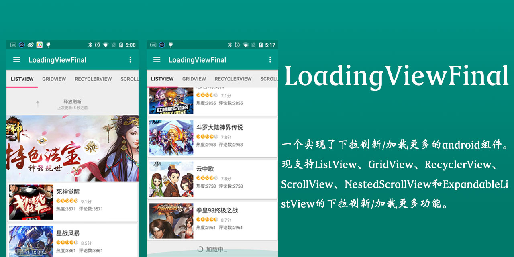

# LoadingViewFinal

一个实现了下拉刷新/加载更多的android组件。现支持ListView、GridView、RecyclerView、ScrollView、NestedScrollView和ExpandableListView的下拉刷新/加载更多功能。

# 支持的功能
* 支持常见组件下拉刷新加载更多
* 默认添加对[Ultra-Pull-To-Refresh](https://github.com/liaohuqiu/android-Ultra-Pull-To-Refresh)和SwipeRefreshLayout下拉支持
* 采用滑动到底部和点击FooterView加载双实现方式
* 支持自定义Load More View
* 自带20多种Load More View样式
* 对SwipeRefreshLayout嵌套ListView、GridView、RecyclerView、ScrollView等组件设置EmpetyView的支持
* 支持ViewPager+下拉刷新组件+ViewPager嵌套方式
* 支持RecyclerView、GridView、ScollView添加HeaderView和FooterView功能
* 支持自动刷新
* ……

# Sample apk下载
[点击](https://raw.githubusercontent.com/pengjianbo/LoadingViewFinal/master/LoadingViewFinal-sample.apk)下载到设备<br/>
扫描二维码下载<br/>


# 如何方法
 **Eclipse请copy源码或aar方式**
 
## 下载LoadingViewFinal
通过Gradle抓取：

* 使用加载更多控件库

```gradle
compile 'cn.finalteam.loadingviewfinal:loading-more-view:1.0.1'
```

* 采用SwipeRefreshLayout下拉刷新库

```gradle
compile 'cn.finalteam.loadingviewfinal:swipe-refresh-layout:1.0.1'
```
* 采用UPTR下拉刷新

```gradle	
compile 'cn.finalteam.loadingviewfinal:ultra-pull-to-refresh:1.0.1'
```
* Load More Footer样式

```gradle
compile 'cn.finalteam.loadingviewfinal:loading-more-style:1.0.1'
```

* 如果你项目中使用了RecyclerView控件请添加

```gradle
compile 'com.android.support:recyclerview-v7:23.2.1'//recyclerview随便哪个版本都可以，没有强制使用23.2.1
```

SwipeRefreshLayout和UPTR两个下拉刷新库可以二选一

## Next Version
* 优化UPTR连续下拉刷新问题
* 结合OkHttpFinal快速集成数据请求方案

## 使用UPTR+RecyclerView下拉刷新/加载更多案例
注：使用UPTR+ListView/GridView/ScrollView...几乎类同

**更多的UPTR功能和特性[请点击这](https://github.com/liaohuqiu/android-Ultra-Pull-To-Refresh)**

### 1、在layout中定义：

```xml
<?xml version="1.0" encoding="utf-8"?>
<FrameLayout xmlns:android="http://schemas.android.com/apk/res/android"
    xmlns:app="http://schemas.android.com/apk/res-auto"
    android:layout_width="match_parent"
    android:layout_height="match_parent">
		
	<!--使用PtrClassicFrameLayout套RecyclerViewFinal-->
    <cn.finalteam.loadingviewfinal.PtrClassicFrameLayout
        android:id="@+id/ptr_rv_layout"
        android:layout_width="match_parent"
        android:layout_height="match_parent"
        app:ptr_duration_to_close="300"
        app:ptr_duration_to_close_header="2000"
        app:ptr_keep_header_when_refresh="true"
        app:ptr_ratio_of_header_height_to_refresh="1.2"
        app:ptr_resistance="1.7">

        <cn.finalteam.loadingviewfinal.RecyclerViewFinal
            android:id="@+id/rv_games"
            android:layout_width="match_parent"
            android:layout_height="match_parent"
            android:cacheColorHint="#00000000"
            app:noLoadMoreHideView="false"<!--默认false-->
            app:loadMoreMode="click|scroll"<!--默认scroll-->
            app:loadMoreView="cn.finalteam.loadingviewfinal.DefaultLoadMoreView"<!--默认DefaultLoadMoreView，可在Java中配置-->
            app:noLoadMoreHideView="false"<!--没有更多了是否隐藏footerview-->
            />

    </cn.finalteam.loadingviewfinal.PtrClassicFrameLayout>

    <include layout="@layout/layout_empty_view"/>
</FrameLayout>
```
### 2、Java代码和Api详解
#### * 自动刷新

```java
mPtrLayout.autoRefresh();
```
#### * 设置下拉刷新监听
 
```java
mPtrLayout.setOnRefreshListener(new OnDefaultRefreshListener() {
    @Override
    public void onRefreshBegin(PtrFrameLayout frame) {
    	//发起下拉刷新请求
		requestData(1);
    }
});
```

#### * 设置加载更多事件监听

```java
mRecyclerViewFinal.setOnLoadMoreListener(new OnLoadMoreListener() {
    @Override
    public void loadMore() {
    	//发起加载更多请求
        requestData(mPage);
    }
});
```
#### * 设置是否有更多

```java
mRecyclerViewFinal.setHasLoadMore(true/false);
```

#### * 设置网络异常FooterView信息

```java
mRecyclerViewFinal.showFailUI();
```
#### * 完成刷新或完成加载功能调用

```java
if (page == 1) { //page == 1表示下拉下拉
	mPtrRvLayout.onRefreshComplete();//完成下拉刷新
} else {
	mRecyclerViewFinal.onLoadMoreComplete();//完成加载更多
}
```
#### * 自定义Load More View样式
**设置自定义样式请在setAdapter之前**。

```java
AVLoadMoreView avLoadMoreView = LoadMoreStyle.getAVLoadMoreViewFactory(context);
avLoadMoreView.setIndicatorColor(getResources().getColor(R.color.colorPrimary));	
avLoadMoreView.setIndicatorId(AVLoadingIndicatorView.BallPulse);
mRecyclerViewFinal.setLoadMoreView(avLoadMoreView);
```
* 设置没有更多了是否隐藏footerview

```java
mRecyclerViewFinal.setNoLoadMoreHideView(true/false);//默认false不隐藏
```

**<font color='red'>注：onLoadMoreComplete()一定要在setHasLoadMore()和showFailUI()之后调用</font>**

具体实现代码[请点击](https://github.com/pengjianbo/LoadingViewFinal/blob/master/app/src/main/java/cn/finalteam/loadingviewfinal/sample/ui/fragment/ptr/PtrListViewFragment.java)

## 使用SwipeRefreshLayout+RecyclerView下拉刷新/加载更多案例

### 1、在layout中定义：

```xml
<?xml version="1.0" encoding="utf-8"?>
<cn.finalteam.loadingviewfinal.SwipeRefreshLayoutFinal xmlns:android="http://schemas.android.com/apk/res/android"
    xmlns:app="http://schemas.android.com/apk/res-auto"
    android:id="@+id/refresh_layout"
    android:layout_width="match_parent"
    android:layout_height="match_parent"
    app:refreshLoadingColor="@color/colorPrimary"><!--设置loading颜色-->

    <FrameLayout
        android:layout_width="match_parent"
        android:layout_height="match_parent">

        <ScrollView
            android:layout_width="match_parent"
            android:layout_height="match_parent"
            android:fillViewport="true">
            <include layout="@layout/layout_empty_view" />
        </ScrollView>

        <cn.finalteam.loadingviewfinal.RecyclerViewFinal
            android:id="@+id/rv_games"
            android:layout_width="match_parent"
            android:layout_height="match_parent"
            android:cacheColorHint="#00000000"
            android:divider="@null"
            app:noLoadMoreHideView="false"<!--默认false-->
            app:loadMoreMode="click|scroll"<!--默认scroll-->
            app:loadMoreView="cn.finalteam.loadingviewfinal.DefaultLoadMoreView"<!--默认DefaultLoadMoreView，可在Java中配置-->
            app:noLoadMoreHideView="false"<!--没有更多了是否隐藏footerview-->
    </FrameLayout>
</cn.finalteam.loadingviewfinal.SwipeRefreshLayoutFinal>
```
### 2、Java代码和Api详解
与使用UPTR类同

# 如何自定义下拉刷新和加载更多样式

## 1、自定义UPTR下拉刷新样式
这里具体不讲有兴趣请查看[UPTR](https://github.com/liaohuqiu/android-Ultra-Pull-To-Refresh),当然后续会添加一个UPTR library样式库。

## 2、自定义LoadMoreView样式
1、实现ILoadMoreView接口，并且实现其方法

# 感谢（Thanks）
* 感谢liaohuqiu大神的下拉刷新库[android-Ultra-Pull-To-Refresh](https://github.com/liaohuqiu/android-Ultra-Pull-To-Refresh)和[GridViewWithHeaderAndFooter](https://github.com/liaohuqiu/android-GridViewWithHeaderAndFooter)库
* Loading控件[AVLoadingIndicatorView](https://github.com/81813780/AVLoadingIndicatorView)

# 关于作者  
* **QQ群:**218801658  
* **Email:**<pengjianbo@finalteam.cn>

License
-------

    Licensed under the Apache License, Version 2.0 (the "License");
    you may not use this file except in compliance with the License.
    You may obtain a copy of the License at

       http://www.apache.org/licenses/LICENSE-2.0

    Unless required by applicable law or agreed to in writing, software
    distributed under the License is distributed on an "AS IS" BASIS,
    WITHOUT WARRANTIES OR CONDITIONS OF ANY KIND, either express or implied.
    See the License for the specific language governing permissions and
    limitations under the License.